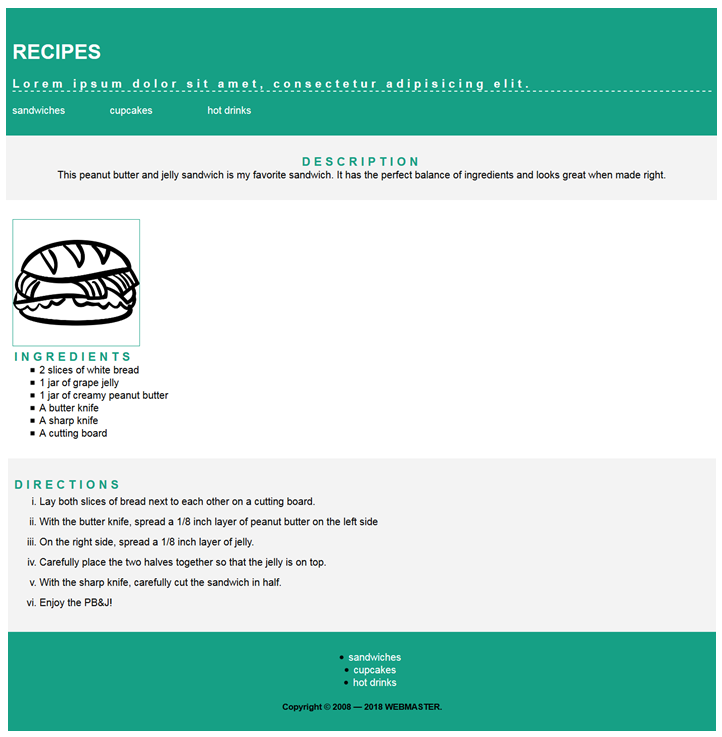

Receptas
website design project

🌟 About
This project is for educational porpuses only. Pull request are welcome, but priority for project authors! Thank you for your cooperation!

Site published at: https://github.com/Silvija96

Design: 

🎯 Project features/goals
Github pages
big screen only (no responsive design)
🧰 Getting Started
💻 Prerequisites
Node.js - download and install

https://nodejs.org
Git - download and install

https://git-scm.com
🏃 Run locally
Would like to run this project locally? Open terminal and follow these steps:

Install NPM packages
npm i
or
npm install
Run the server
npm run dev
🧪 Running tests
There is no tests for this project.

Authors
Silvija: https://github.com/Silvija96

⚠️ License
Distributed under the MIT License. See LICENSE.txt for more information.

🔗 Other resources
No other resources.
